# Arm Toolchain
A toolchain is a set of programming tools, like a compiler, linker, debugger, etc., that facilitate development of programs written for the same or different hardware. The Raspberry Pi Pico has RP2040 onboard which is a microcontroller based on Arm Cortex M0+ architecture. The detailed steps for installing [GNU Embedded Toolchain for Arm](https://developer.arm.com/downloads/-/gnu-rm) in each operating system are provided below ([Mac](./armToolchain.md#macos) and [Windows](./armToolchain.md#windowslinux)). Note that [CMake](https://cmake.org/) will also be installed along with the Arm toolchain. [CMake](https://cmake.org/) will take care of calling all the necessary programs, from the toolchain, to generate a binary file that will run on the microcontroller.

## MacOS
- Open the terminal.

### Step 1
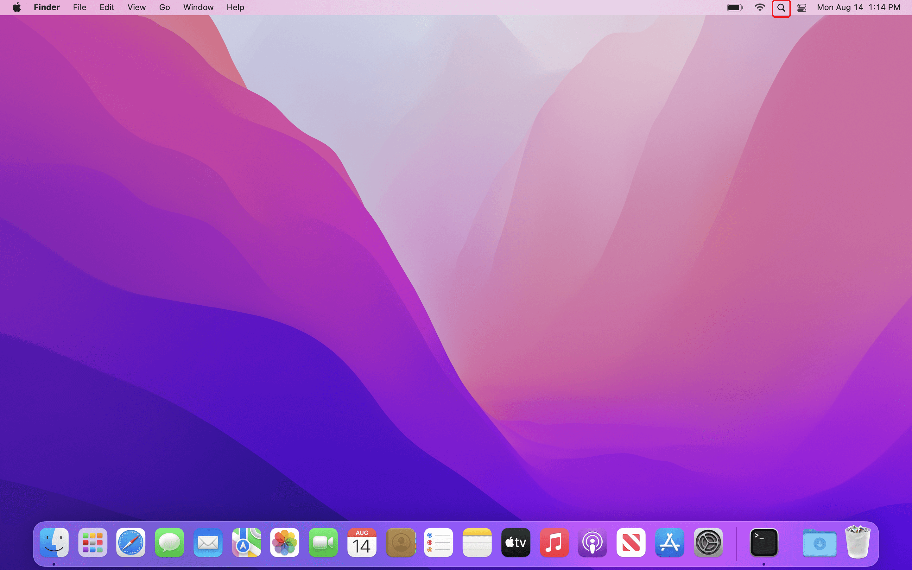
### Step 2
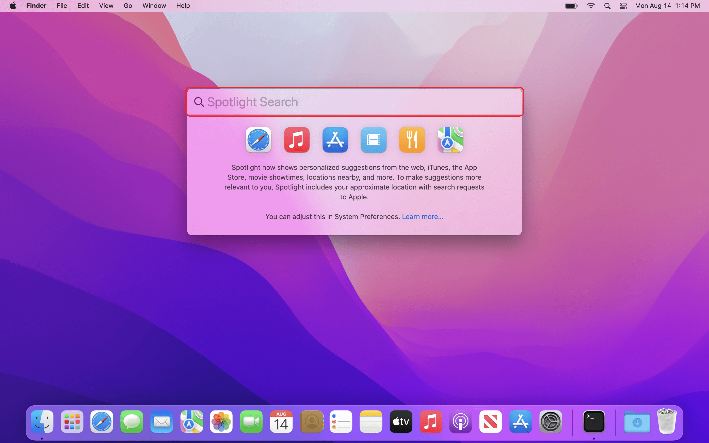
### Step 3

### Step 4
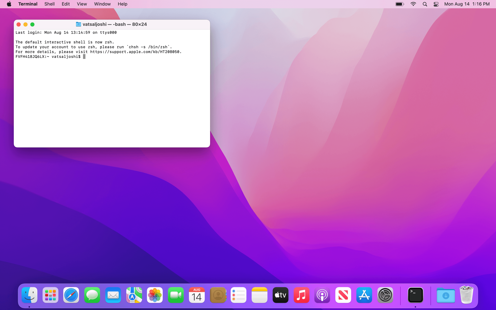

- Check if your MacBook has Apple chip or Intel chip.
### Step 1
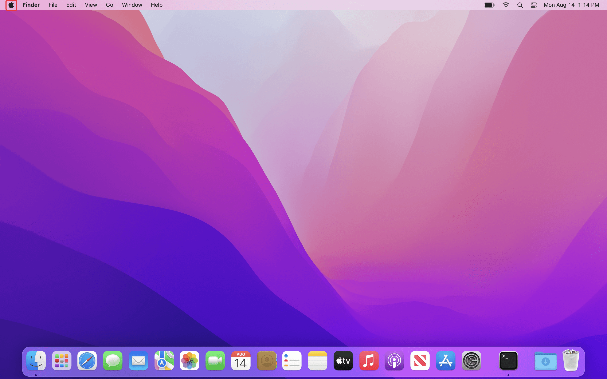
### Step 2
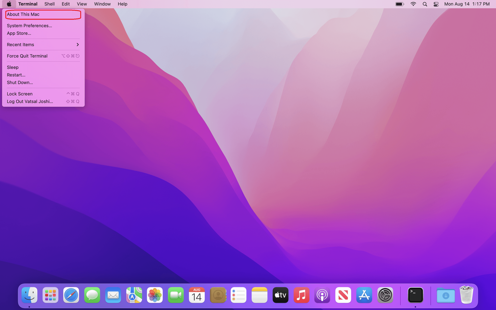
### Step 3
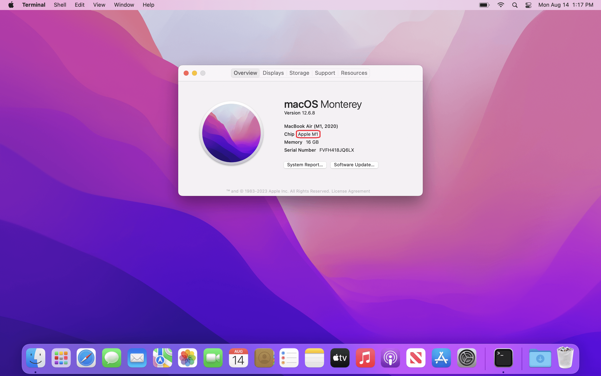

- If your MacBook has Apple chip then enter following commands in the terminal, continue to the next step otherwise.
    ```bash
    $ /usr/sbin/softwareupdate --install-rosetta --agree-to-license
    ```
- Install 'Xcode Command Line Tools' and 'Homebrew' by entering following command in the terminal. The system may ask you to type your password and press <kbd>↩&#160;Return</kbd> at some point.
    ```bash
    $ /bin/bash -c "$(curl -fsSL https://raw.githubusercontent.com/Homebrew/install/master/install.sh)"
    ```
- Once 'Homebrew' is installed, it may ask you to perform some extra steps. Generally, these steps correspond to adding 'Homebrew' to the `PATH` environment. Following images show the steps I was asked to perform.

### Step 1

### Step 2
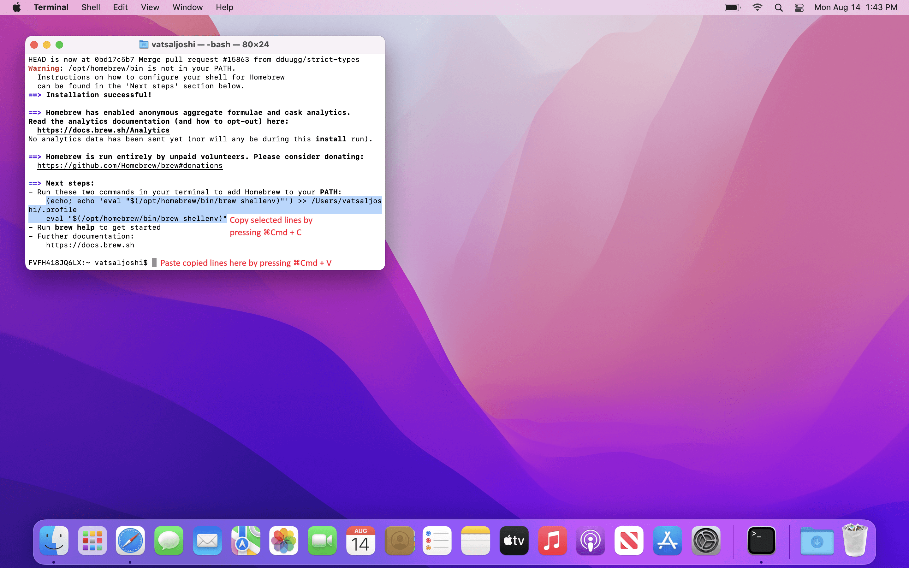
### Step 3
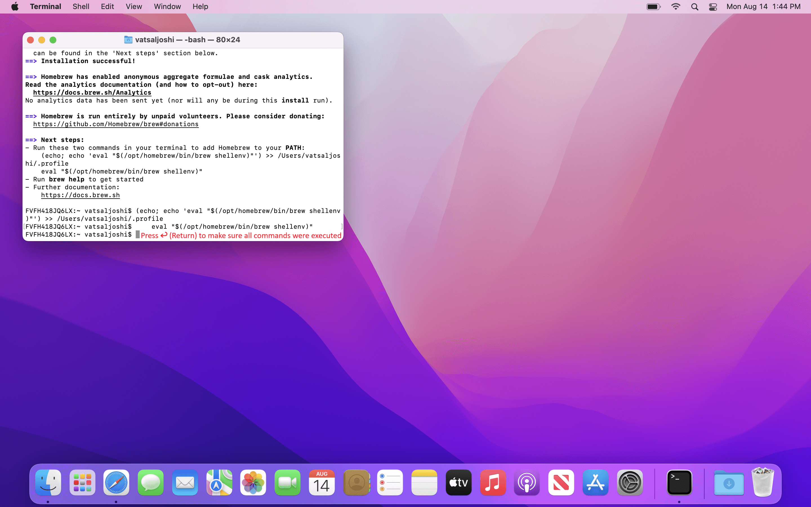

- Close the terminal and reopen it.
- Enter following commands in the terminal app to install the 'Embedded Toolchain for Arm' and 'CMake'.
    ```bash
    $ brew install cmake
    $ brew install gcc-arm-embedded
    ```
- Restart your MacBook.

## Windows/Linux
- Open Ubuntu terminal.

### Step 1
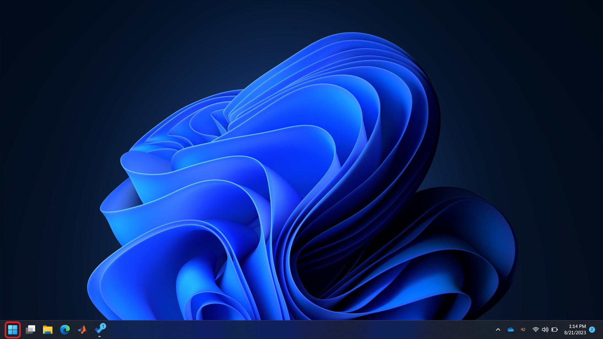
### Step 2
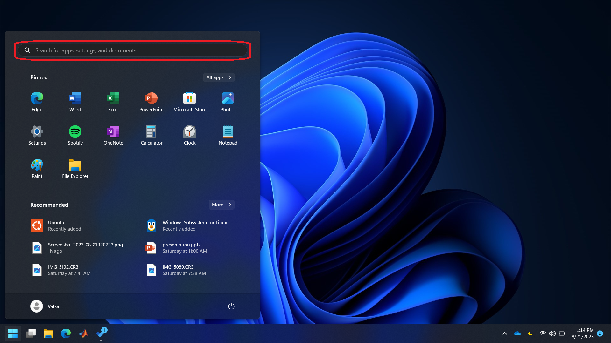
### Step 3
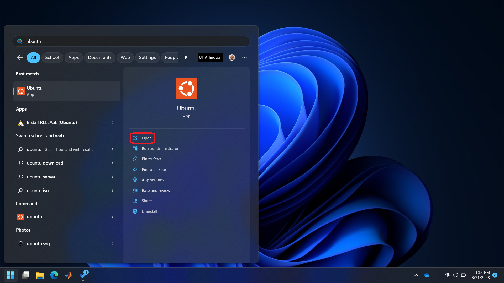
### Step 4
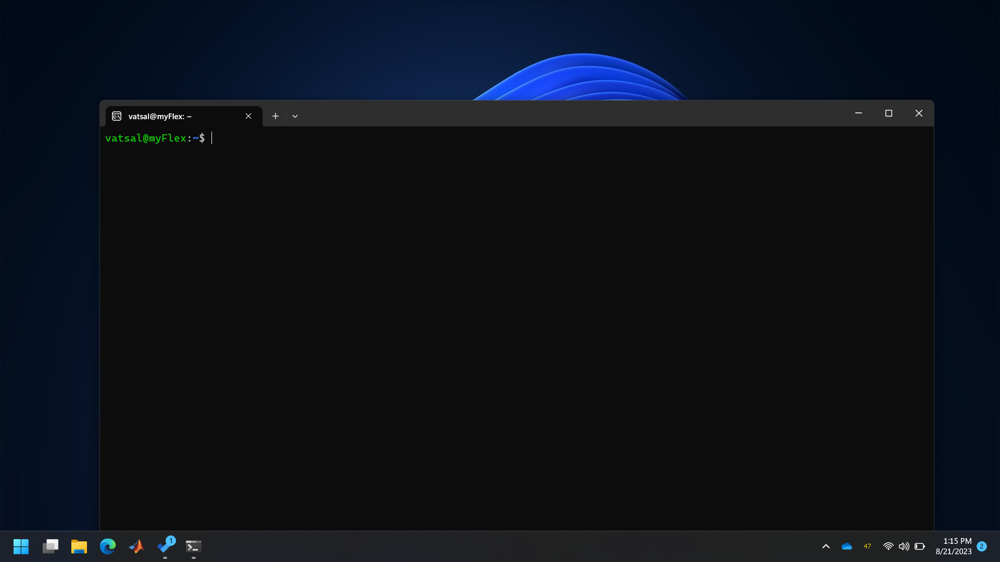

- Enter following commands to install the 'Arm Toolchain' and 'CMake'. Note that the `$` symbol, also called a 'Prompt', represents start of the line, so don't type it. The system may ask you to type your password and press <kbd>⏎&#160;Enter</kbd> at some point.
    ```bash
    $ sudo apt update
    $ sudo apt upgrade
    $ sudo apt install cmake gcc-arm-none-eabi libnewlib-arm-none-eabi build-essential
    ```
## Next

- [Text Editor](../sec02/textEditor.md#text-editor)

## Back

- [Back to Software Installation](../softwareInstallation.md#next-steps)
