# Software Installation
Before we go about writing the code for the microcontroller programming, it is important to make sure that everyone can follow along the coding process regardless of the operating system they use. Majority of the PCs or Laptops in today's time would be running either 1. Windows, 2. MacOS or 3. Linux. Even though the software necessary for microcontroller programming can be set-up in many ways for each operating system, the goal here is to make the process independent of the operating system being used. Upcoming paragraphs discuss how this is achieved for each operating system.

## MacOS
MacOS and Linux are very similar in operation for the purpose of the microcontroller programming in this book. The small changes necessary to make MacOS behave as expected are provided below.
- Open terminal app. Note that `zsh` is being used as the default shell. If `bash` is being used then continue to the [Bash Steps](softwareInstallation.md#bash-steps)
### Zsh Steps
#### Step 1
    
#### Step 2
    
#### Step 3
    
#### Step 4
    
    
- Type following and hit enter. You may be prompted to enter your password. Note that the `%` symbol, also called a 'Prompt', represents start of the line, so don't type it.
    ```zsh
    % chsh -s /bin/bash
    ```
- Exit the terminal app and reopen it. Note that it is now using `bash` as the default shell. Also, the prompt, `%` for `zsh`, is now changed to `$`.

  ### Bash Steps
  #### Step 1
        
  #### Step 2
    
  #### Step 3
    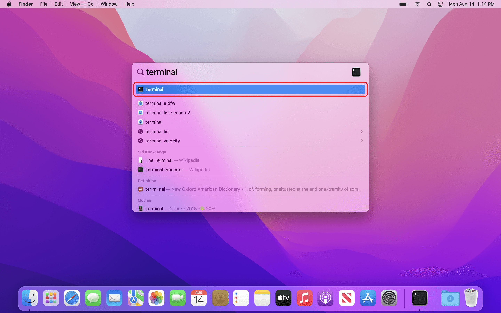
  #### Step 4
    

## Windows
To get Windows to a similar state, a virtual Linux operating system can be installed in it. Windows provides [WSL](https://learn.microsoft.com/en-us/windows/wsl/about) for this purpose. A brief installation guide for WSL is provided at [https://learn.microsoft.com/en-us/windows/wsl/install](https://learn.microsoft.com/en-us/windows/wsl/install). Following are the step-wise instructions with images to install WSL.
- Check the status of hardware virtualization.
  ### Check Hardware Virtualization 
  #### Step 1
    
  #### Step 2
    
  #### Step 3
    
  #### Step 4
    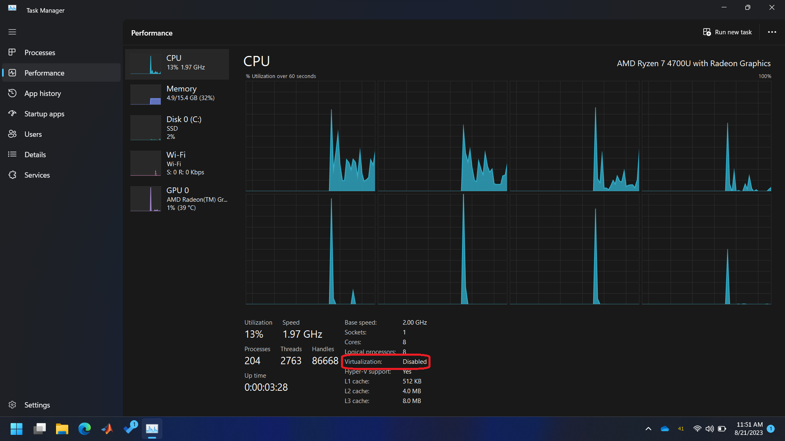

- If the hardware virtualization is disabled then follow images given below to boot the computer in BIOS for activating the hardware virtualization. The BIOS menu will look different based on the manufacturer. Windows also has [detailed instructions](https://support.microsoft.com/en-us/windows/enable-virtualization-on-windows-11-pcs-c5578302-6e43-4b4b-a449-8ced115f58e1) on activating hardware virtualization for most manufacturers. In the BIOS settings, find the configuration items related to the CPU. These can be under the headings Processor, Chipset, or Northbridge. Enable virtualization; the setting may be called VT-x, AMD-V, SVM, or Vanderpool. Enable Intel VT-d or AMD IOMMU if the options are available. Save your changes and reboot.
    ```{note}
    Contact your TA or instructor if you don't feel comfortable changing options in your BIOS.
    ```
    ### Enable Hardware Virtualization
  
    #### Step 1
    
    
    #### Step 2
    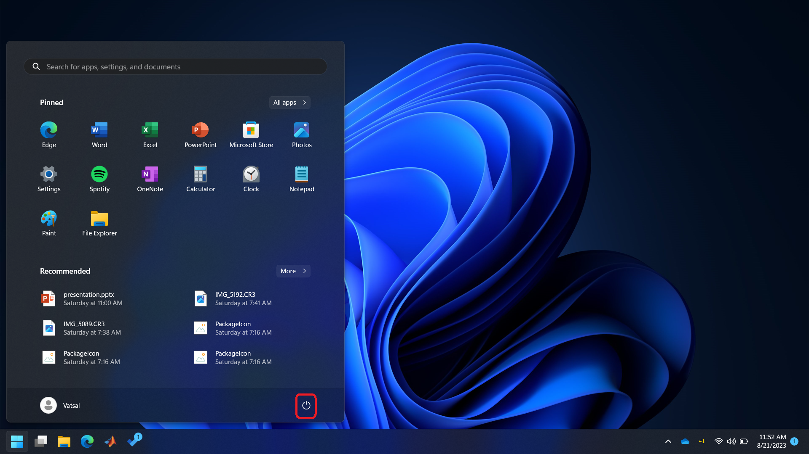
    
    #### Step 3
    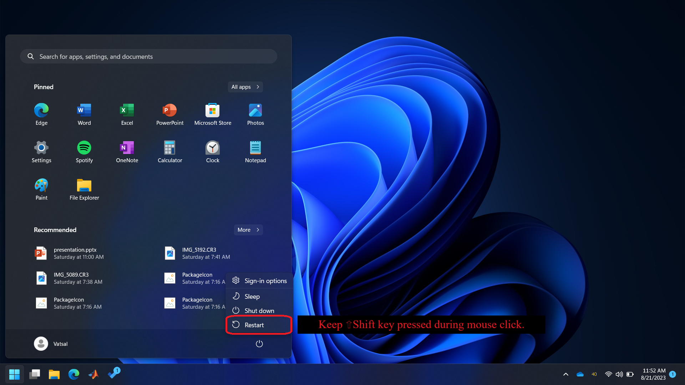
    
    #### Step 4
    
    
    #### Step 5
    
    
    #### Step 6
    
    
    #### Step 7
    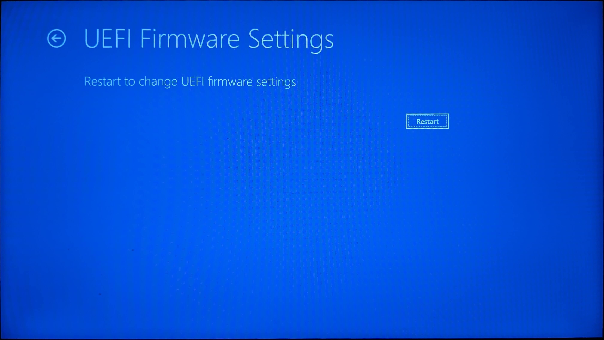
    
    #### Step 8
    
    
    #### Step 9
    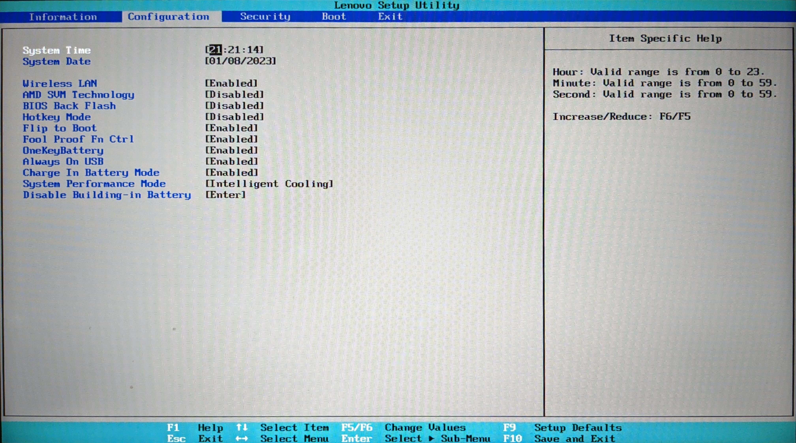
    
    #### Step 10
    
    
    #### Step 11
    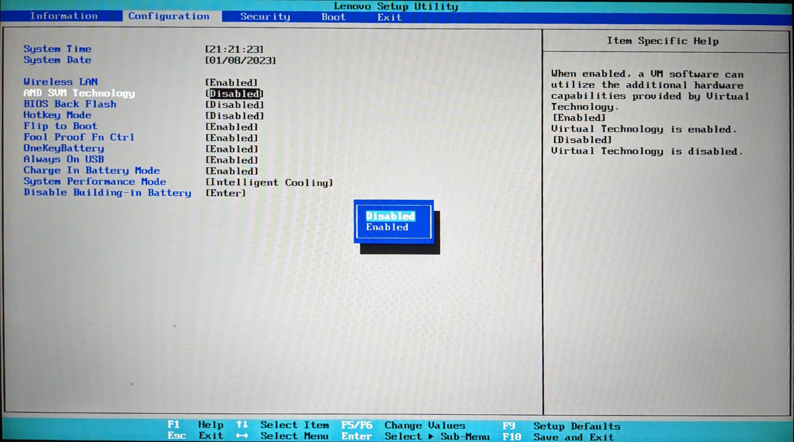
    
    #### Step 12
    
    
    #### Step 13
    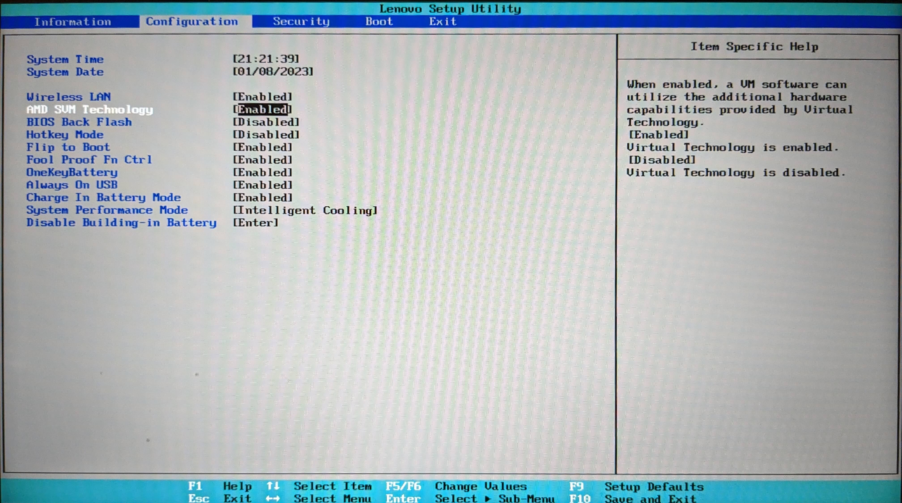
    
    #### Step 14
    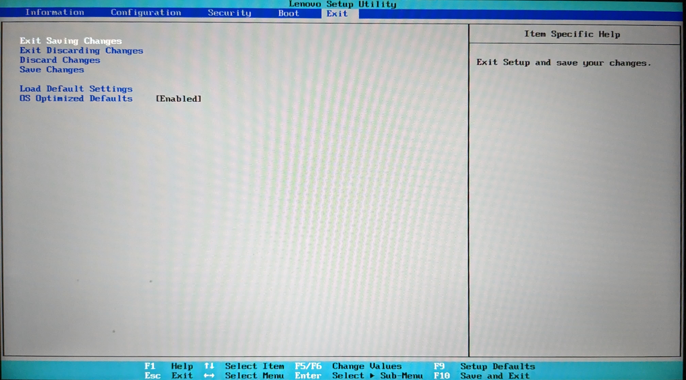
    
    #### Step 15
    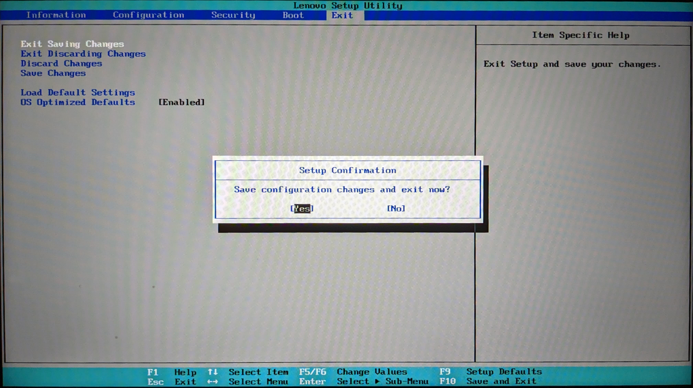
    
    #### Step 16
    

    #### Step 17
    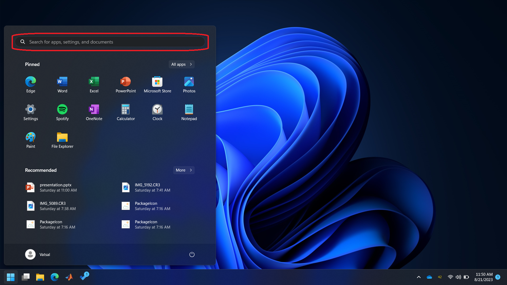

    #### Step 18
    

    #### Step 19
    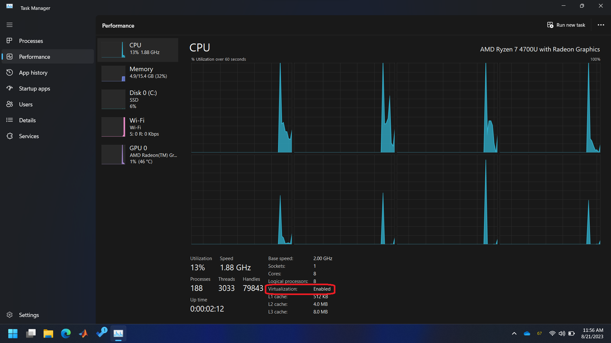

- Check Windows version and build number.
    ### Checking Windows Build Number

    #### Step 1
    

    #### Step} 2
    

    #### Step} 3
    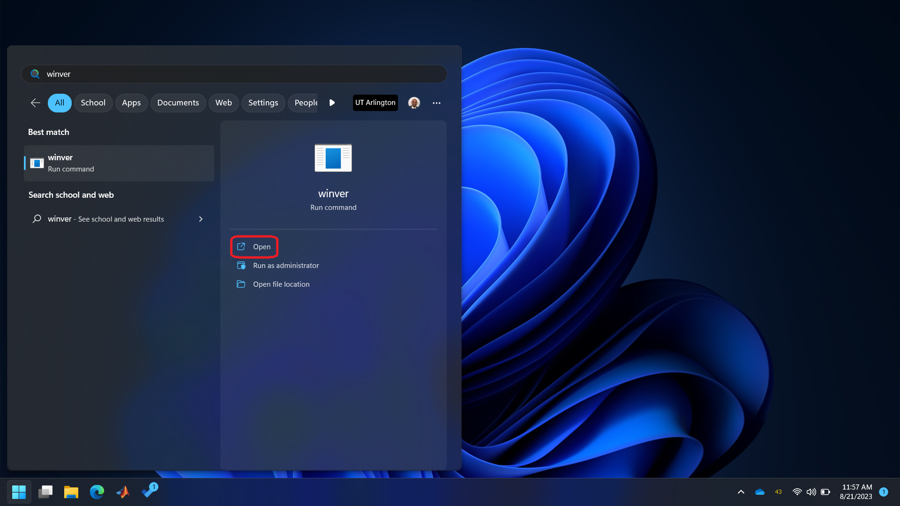

    #### Step 4
    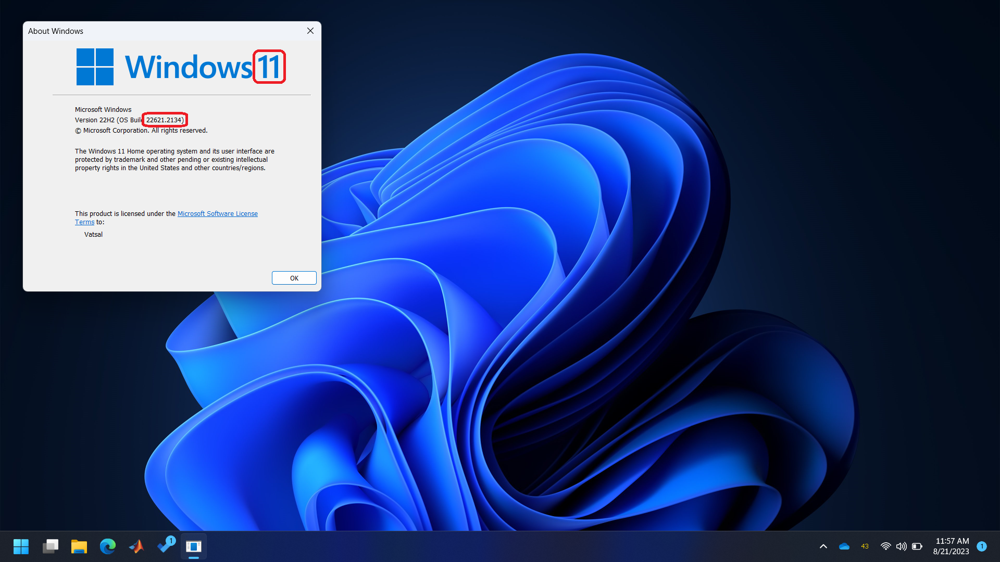

- If the installed version is Windows 10 and the build number is less than 19041, then follow steps given in [https://learn.microsoft.com/en-us/windows/wsl/install-manual](https://learn.microsoft.com/en-us/windows/wsl/install-manual) and then continue to the step for [Ubuntu initialization](windowsInit). Otherwise, continue with the steps given below.
    ```{note}
    Contact your TA or instructor if you find the steps given in the link too dificult to follow.
    ```
- Open Powershell with administrator privileges. Windows may ask for the ‘User Access Control’, please allow it.
    
  #### Step 1
    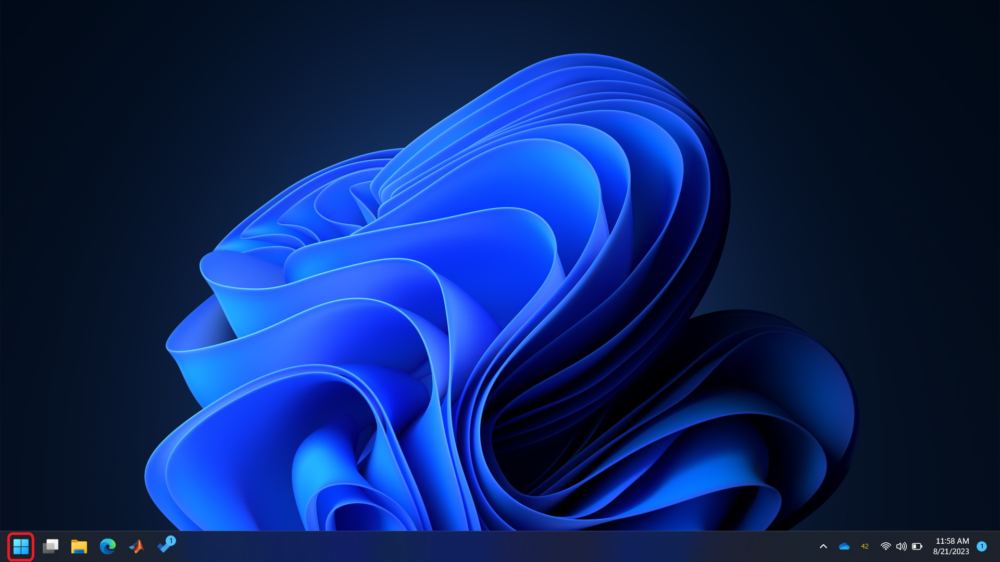
   
  #### Step 2
    
  #### Step 3
    
  #### Step  4
    

- Type `wsl --install`. This will enable and install some software components in Windows. It will also install a Linux distribution called Ubuntu in Windows. Once the installation is finished, you'll receive a message as shown below.

    

- Close Powershell and restart Windows.
- A window called 'Ubuntu' should automatically open up after the restart. This window may also be called Terminal, Bash, Command Line, etc. Throughout this book, we'll refer to it as a terminal.
- Provide desired username and password. Note that the characters you type for the password will not show up. Just type the desired password and then press enter.
    #### Step 1
    :name: windowsInit
    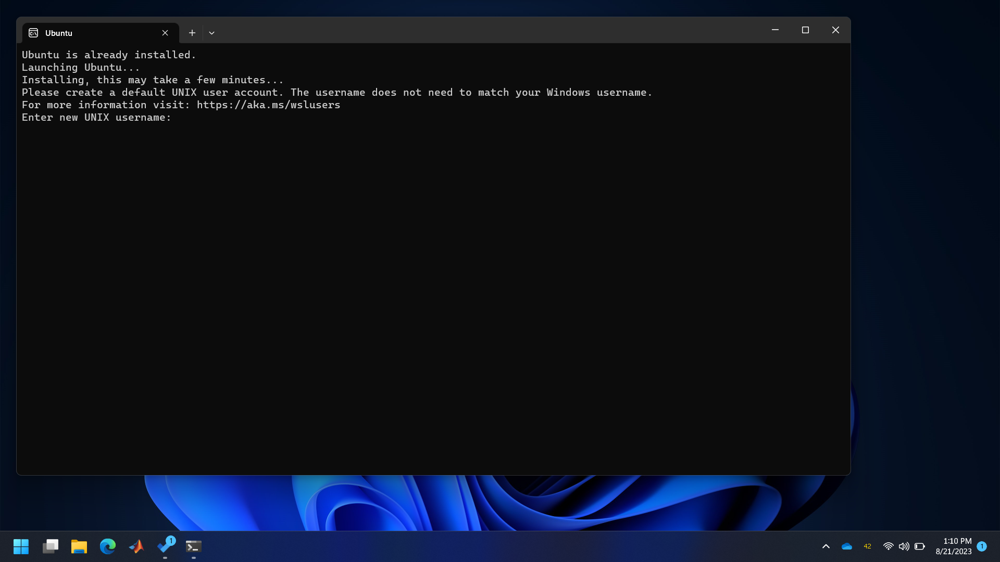
    #### Step 2
    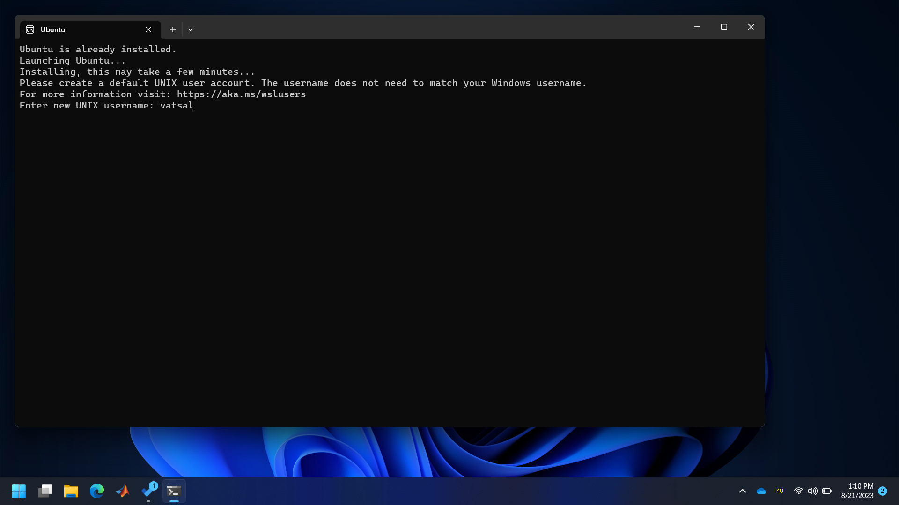
    #### Step 3
    
    #### Step 4
    
    #### Step 5
    

- Ubuntu is now installed and setup. You can close the window.


## Next Steps
The software necessary to develop the C/C++ code for the microcontroller can be installed now. Instructions for installing this software for Raspberry Pi Pico can be found in its [Getting Started](https://datasheets.raspberrypi.com/pico/getting-started-with-pico.pdf) guide. Upcoming sections provide a more detailed version of the same.

- [Arm Toolchain](./sec01/armToolchain.md)
- [Text Editor](./sec02/textEditor.md#text-editor)
- [Raspberry Pi Pico C/C++ SDK](./sec03/piPicoSDK.md)
- [Hello World](./sec04/helloWorld.md)

## Back to Introduction
[Back](../intro.md)

