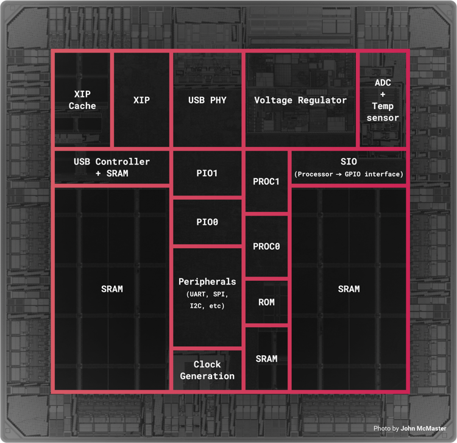

# What is a Microcontroller?
Everyone nowadays have at least one computer with them, it's either the smartphone or a laptop or maybe a workstation. All of these devices have a CPU (Central Processing Unit), also known as a **microprocessor** (&mu;P), where the computation happens. Apart from a CPU, these devices also have a couple of GBs of RAM (Random Access Memory) and hundreds of GBs in the form of HDD (Hard Disk Drive) or SSD (Solid State Drive) for information storage. Along with these building blocks, each device may have extra hardware for different types of I/O (Input/Output) like USB, Wi-Fi, SDCard Reader, etc. All of these components/hardware is made to talk with each other with the help of a big circuit board known as motherboard.

A (&mu;C) with all it's functional blocks on a single chip

                                                            
Contrary to a &mu;P based distributed system, such as one discussed above, a **microcontroller** (&mu;C) has almost everything embedded in a single chip. This difference enforces different design constraints for both the systems and in effect cause them to be used in different applications. Following are some differences between &mu;P based systems and &mu;Cs
- It is difficult to produce large chips/silicon dies without a fault, thus &mu;Cs are limited in size while &mu;P based systems can be large due to their distributed nature.
- Chip size is somewhat proportional to the computation power, thus the &mu;Cs are always computationally less powerful than a &mu;P based system.
- Due to their smaller size/footprint, a &mu;C generally doesn't face problems related to heat dissipation. To the contrary, &mu;P based systems almost always require extra components for heat dissipation.
- Since the majority of functional components (RAM, storage, etc.) are embedded on a single chip, the signal transmission time is much lower in case of &mu;C as compared to the &mu;P based system. This makes &mu;Cs suitable for real-time applications.

Apart from these major differences, the type of I/O used for &mu;Cs is also slightly different. The I/O in &mu;Cs include PWM (Puls Width Modulation), I2C (Inter-Integrated Circuit), ADC (Analog to Digital Converter), etc. These I/O functionalities for &mu;Cs are more collectively known as **Peripherals**.

Keep in mind that the differences discussed above are not strict. The boundaries between &mu;Cs and &mu;Ps are getting blurrier. For example, some manufacturers now allow external flash (where the program is stored) to be connected to a &mu;C, the base clock speed of some consumer &mu;Cs has now reached close to 1GHz, etc. Thus, this distinction between &mu;C and &mu;P based systems might change over a period of time as technology advances.

# Back 

[Back to Chapter 2](../preliminaries.md)
