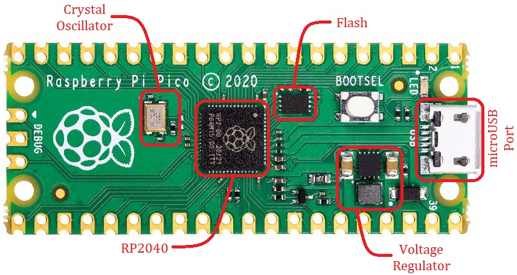
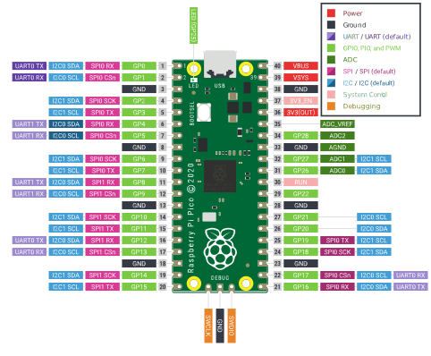

# RP2040 and Raspberry Pi Pico
The RP2040 is a dual core &mu;C with Arm Cortex M0+ architecture. It can run with a 133MHz clock signal safely. It has 264kBs of RAM embedded in the chip. Although it doesn't have any on-chip flash, it supports up to 16MBs of external flash memory. It has 30 programmable GPIO (General Purpose Input-Output) pins, out of which 4 can be used to read analog voltage. The RP2040 has the following peripherals on board, some of which we'll discuss throughout this course.
- 2 UART modules
- 2 SPI controllers
- 2 I2C controllers
- 8 independently configurable PWM slices with two channels each
- USB 1.1 controller
- 64-bit timer

The Raspberry Pi Pico comes with the RP2040 &mu;C, a 2MB external flash memory, a microUSB port and some power regulation components as shown below. We'll discuss the `BOOTSEL` button in the next section.
<p align = "center">

  Top View of the Raspberry Pi Pico
</p>

Note that there are 43 gold-plated pads with holes on the edges of the Pico. Each of these may or may not be a GPIO pin. Thus, we'll refer to these as a 'Physical Pin' while we'll refer to a GPIO pin as a 'Pin'. Following diagram shows the function each physical pin can perform. Such a diagram is known as a 'Pinout Diagram'. A PDF version of this Pinout diagram is available [here](https://datasheets.raspberrypi.com/pico/Pico-R3-A4-Pinout.pdf).
<p align = "center">

Pinout Diagram of the Raspberry Pi Pico
</p>


Note that **GPIO23**, **GPIO24**, **GPIO25** and **GPIO29** are missing from the board. These still exist but are connected to different components on the board already. The specific use of each of these pins is discussed in the [Raspberry Pi Pico Datasheet](https://datasheets.raspberrypi.com/pico/pico-datasheet.pdf).

Keep in mind that this &mu;C works on 3.3V logic level. What this means is that 0V or GND is treated as value 0, aka 'Signal LOW' or logical false, while 3.3V is treated as value 1, aka 'Signal HIGH' or logical true. Thus, it is advised not to apply voltage higher than 3.3V to any pins. There exist other &mu;C boards, ex. [Arduino Uno](https://store-usa.arduino.cc/products/arduino-uno-rev3?selectedStore=us), that work on 5V logic level. We'll eventually discuss how to make two &mu;Cs communicate if they operate at different logic levels.
```{note}
Pins that are capable of reading analog voltage can be an exception to the above rule, i.e. 0V = 0 and 3.3V = 1.
```
# Back

[Back to Chapter 3](../theMicrocontrollerAndCodeDevelopment.md)
