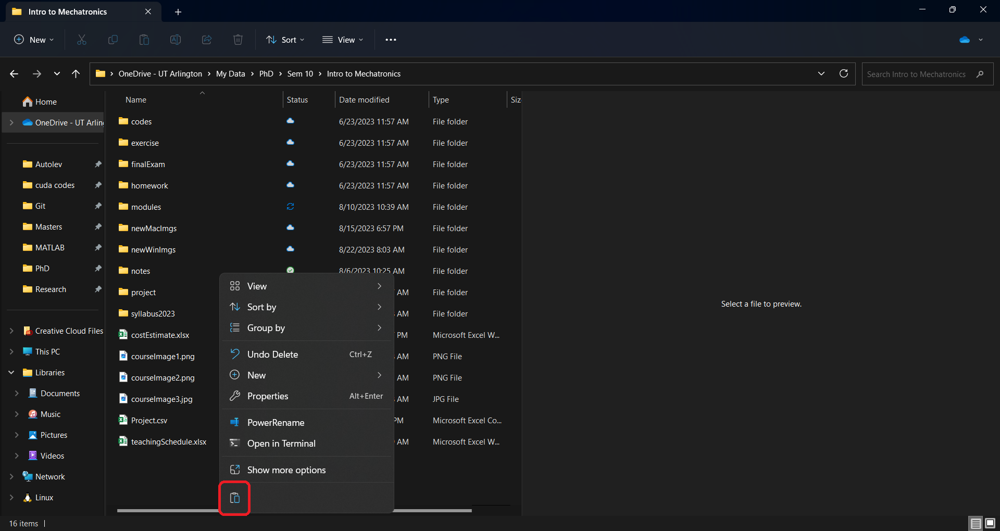
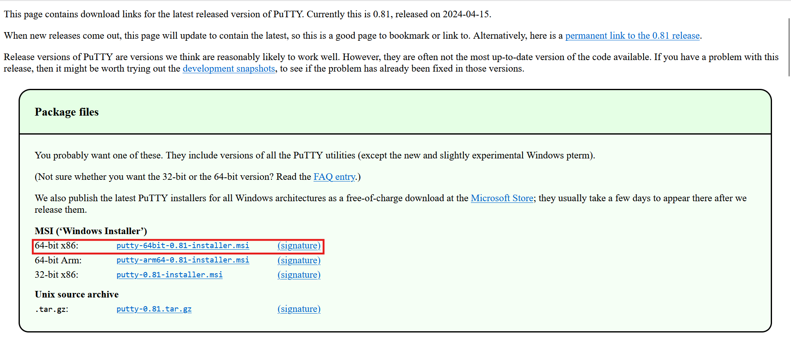

# &mu;C-Laptop Communication
We learned how to upload a compiled binary to the &mu;C in the last section. Specifically, a code that would print `Hello World!` to the 'Standard Input Output' was uploaded. You might be wondering how we can see this output from the &mu;C. Following subsections show steps on how to do exactly that using a software called '[CoolTerm](https://freeware.the-meiers.org/)' on both [Windows](ucLaptopComm.md#windows) and [Mac](ucLaptopComm.md#macos)  devices.

## MacOS
- Download CoolTerm for Mac from [this](https://freeware.the-meiers.org/) website as shown below.
### Step 1

  
- Open the downloaded `CoolTermMac.dmg` file to install CoolTerm. Don't forget to drag and drop the 'CoolTerm' icon to the 'Applications' folder as shown below.

### Step 1

### Step 2

### Step 3

### Step 4

### Step 5

### Step 6

- Mac will prevent the application from running when you double-click the 'CoolTerm' icon from the 'Applications' folder as shown below.
### Step 1

### Step 2

- To force run the app, right-click on the 'CoolTerm' icon and then click on 'Open' as shown below.

### Step 1

### Step 2

### Step 3

### Step 4

- Connect the &mu;C to the Mac without pressing the `BOOTSEL` button. Now, re-scan the COM ports so that the &mu;C is detected.

### Step 1

### Step 2

### Step 3

- Check for the available ports drop arrow in the highlighted box. You should see a port in the list with the eord **usb** in the name. Note the newly added port, since it should stay the same in your Mac for your &mu;C. In my case, it turned out to be **usbmodem1422201**, as visible in the image below. Select the newly added port.
### Step 1

- Click on <kbd>&rlarr; Connect</kbd> button to start communication between the &mu;C and the Mac. You should see 'Hello World!' being printed out as shown below (provided the code compiled in the Software Installation Section has been copied to &mu;C).
### Step  1

- You can stop the communication by clicking on the <kbd>Disconnect</kbd> button.
- At the time of closing, CoolTerm may ask you to save the settings. Click on <kbd>Don't Save</kbd> button.

## Windows
- Download CoolTerm from [this](https://freeware.the-meiers.org/) website. The 'Intel 64Bit' version should work for most Windows 10/11 users as shown below.
### Step 1

- Open the downloaded `CoolTermWin64Bit.zip` file. Copy the folder `CoolTermWin64Bit` to wherever you like.
### Step 1

### Step 2

### Step 3

### Step 4

- Run CoolTerm, make sure that the &mu;C is not connected to the computer. Windows may not recognize the app. In that case, you may have to force run the app as shown below.
### Step 1

### Step 2

### Step 3

### Step 4

### Step 5

### Step 6

- Connect the &mu;C to the computer without pressing the `BOOTSEL` button. Now, re-scan the COM ports so that the &mu;C is detected.
### Step 1

### Step 2

### Step 3

- Check for the available COM port using the drop arrow in the highlighted box. You should see a COM port in the list with the words **USB SERIAL DEVICE** in brackets. Note the newly added COM port number, since it should stay the same in your computer for your &mu;C. In my case, it turned out to be COM3 as visible in the image below. Select the newly added COM port.
### Step 1

- Click on <kbd>&rlarr; Connect</kbd> button to start communication between the &mu;C and the computer. You should see 'Hello World!' being printed out as shown below (provided the code compiled in the Software Installation Section has been copied to &mu;C).
### Step 1

  
- You can stop the communication by clicking on the <kbd>Disconnect</kbd> button.
- At the time of closing, CoolTerm may ask you to save the settings. Click on <kbd>Don't Save</kbd> button.

**It has been seen that CoolTerm doesn't work well on certain Windows devices and it takes too long to start up. If you are having issues, you can instead install Putty, whose interface, though is not as fancy as CoolTerm, is very simple and works on all devices. Instructions for installation of Putty are below**

## Step 1
Go to the [website](https://www.chiark.greenend.org.uk/~sgtatham/putty/latest.html) and download the 64 bit x86 MSI Installer.

## Step 2
Open the installer and follow the instructions to install it. You should be able to see the Putty App in your Search bar at the end of the install process.

## Step 3

On detailed instructions on how to run  Putty, see the lecture video for 6 September 2024 on canvas

# Back
[Back to Chapter 3](../theMicrocontrollerAndCodeDevelopment.md)
