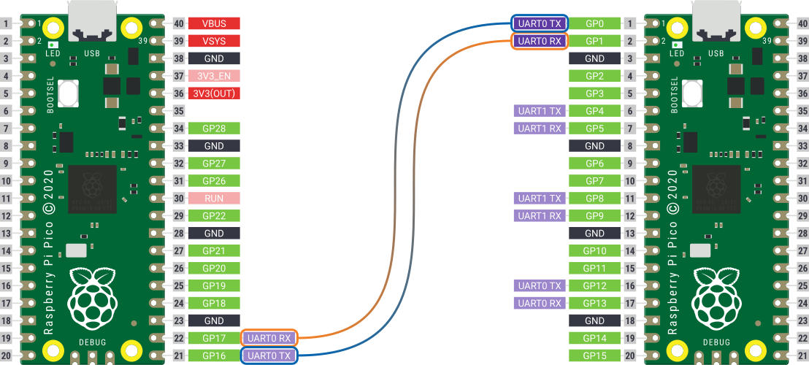

# Universal Asynchronous Receiver-Transmitter
UART, or universal asynchronous receiver-transmitter, is one of the most used device-to-device communication protocols. It is very simple and only uses two wires to transmit and receive data between two devices. The idea is to transfer information bit-by-bit, this is also known as serial communication. The information of a bit is represented by a voltage, i.e. 0V means `0` and 3.3V means `1`. This is exactly what GPIOs do, and thus GPIOs are used in conjunction with UART peripheral for communication. Moreover, UART is an asynchronous communication protocol. Thus, the two devices communicating through UART doesn't need a common clock signal to sync the voltage measurement timings.

The RP2040 has two independent UART instances, `uart0` and `uart1`. Note that the **TX** and **RX** in that table correspond to Transmit and Receive functions. While, the **RTS** and **CTS** are called Output Flow Control and Input Flow Controlled respectively, which are not going to be discussed and used here. The connection for UART communication between two devices can be set up as shown below. The important thing to remember here is that the **TX** pin of one device is always connected to the **RX** pin of the second device.

## Sections
- [Section 1 - Working of a UART](./sec01/working.md)
- [Section 2 - `hardware_gpio` Library Functions](sec02/libraryFunctions.md)
- [Section 3 - Code Examples](sec03/codeExamples.md)
